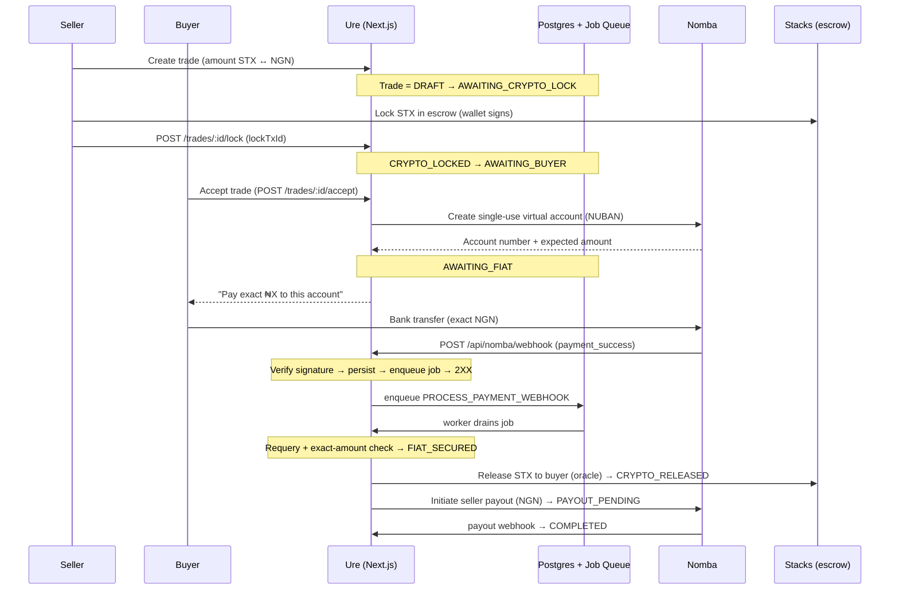
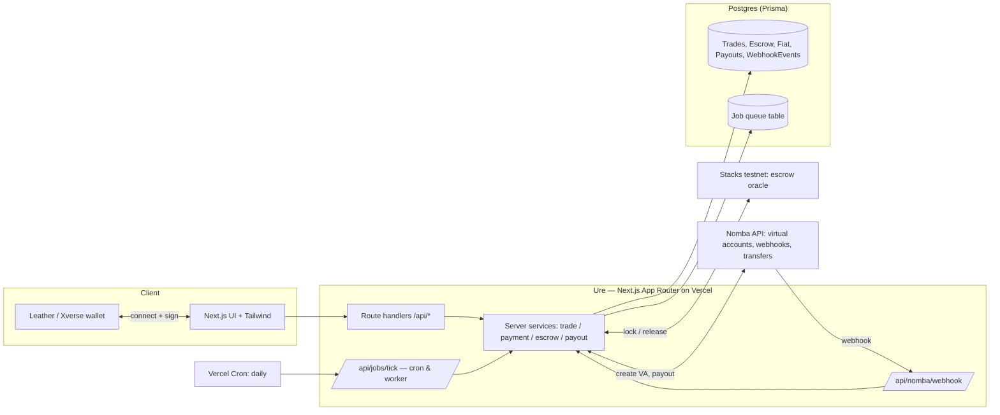

# Ure

**A P2P fiat-to-crypto escrow bridge — swap Nigerian Naira (NGN) for Stacks (STX) safely, so neither party can be cheated.**

[](https://devcareer.io/programs/nomba-hackathon)

Built for the [Nomba x DevCareer Hackathon](https://devcareer.io/programs/nomba-hackathon).

---

## 1. The problem

In Nigeria, peer-to-peer crypto trades usually happen over chat: a buyer sends Naira to a seller's bank account and trusts the seller to send crypto afterward — or vice versa. Whoever moves second can be defrauded. There is no neutral party holding value while the other side pays.

**Ure** removes that trust requirement for a single, clean trade shape. The seller's crypto is locked in escrow *before* the buyer pays fiat, a unique bank account collects the *exact* Naira amount, and the crypto is only released once the fiat is independently confirmed. Neither side has to trust the other — they trust the escrow flow.

## 2. Live demo & current status

**Live:** [ure-ten.vercel.app](https://ure-ten.vercel.app)

> ⚠️ **This is a hackathon MVP, not a production system. Please read before evaluating:**
>
> - **Mock mode by default.** When live Nomba credentials are absent, Ure runs a deterministic **mock driver** for payment provisioning, webhooks, and payouts (see [`src/lib/nomba.ts`](src/lib/nomba.ts)). This lets the *entire* trade loop run end-to-end without a live Nomba account. Real credentials in Vercel are still needed to exit mock mode and confirm real money movement.
> - **On-chain escrow is stubbed.** Stacks lock/release currently runs in a **mock chain mode** ([`src/lib/stacks.ts`](src/lib/stacks.ts), [`src/server/escrow-service.ts`](src/server/escrow-service.ts)). Synthetic transaction IDs are generated and "confirmed" so the flow is demoable; the real oracle contract-call is deferred to "Phase D" (see [Roadmap](#14-roadmap)).
> - **Testnet only.** All Stacks configuration targets **testnet**. Do not send mainnet funds.
> - **Webhook wiring in progress.** The Nomba webhook endpoint is reachable and a signature-verification edge case was recently fixed ([`buildNombaSignatureMessage`](src/lib/nomba.ts) handles the `responseCode === "null"` collapse). It has not yet been exercised against live Nomba traffic.

## 3. How it works

The happy path moves a trade through a state machine (see the `TradeStatus` enum in [`prisma/schema.prisma`](prisma/schema.prisma)):



In plain terms:

1. **Seller locks STX** in escrow and records the lock transaction.
2. **Buyer accepts** and receives a **unique single-use bank account (NUBAN)** from Nomba, scoped to that one trade.
3. **Buyer pays the exact NGN** amount to that account.
4. **Nomba fires a webhook.** Ure verifies it, records it, and enqueues a job — it does **not** release crypto inline.
5. **A background worker** requeries the payment, confirms it is an *exact* match, releases STX to the buyer, then **pays the seller** in NGN.
6. **Trade complete.**

## 4. Architecture



**Why a DB-driven job queue?** Vercel's serverless functions have no persistent worker process. Ure stores jobs in a Postgres `Job` table ([`src/server/jobs/queue.ts`](src/server/jobs/queue.ts)) and drains them two ways:

- **Post-response drain** — after the webhook returns 2XX, `after()` triggers `drainJobs()` in the function's post-response window ([`src/app/api/nomba/webhook/route.ts`](src/app/api/nomba/webhook/route.ts)), so the cascade (payment → release → payout) usually completes within one request.
- **Cron safety net** — a daily Vercel Cron hits [`/api/jobs/tick`](src/app/api/jobs/tick/route.ts) to pick up anything delayed or retried ([`vercel.json`](vercel.json)). A standalone poller ([`scripts/worker.mjs`](scripts/worker.mjs)) can also drain the queue on an interval in non-serverless deployments.

Jobs are claimed with **optimistic locking** (`claimNextJob`) and retried with **exponential backoff** up to `maxAttempts` before landing in `FAILED` for review.

## 5. Tech stack

| Tool | Purpose |
|------|---------|
| **Next.js 16 (App Router)** | Full-stack framework — UI + `/api` route handlers |
| **React 19 + Tailwind CSS 4** | Frontend UI |
| **Prisma 7 + PostgreSQL** | ORM and system of record (trades, escrow, jobs, audit) |
| **`@prisma/adapter-pg` / `pg`** | Postgres driver adapter |
| **Zod 4** | Request body + environment variable validation |
| **`@stacks/connect`, `@stacks/transactions`, `@stacks/network`, `@stacks/encryption`** | Wallet connect (Leather/Xverse), signature verification, escrow tx building |
| **Nomba** | Fiat rails — single-use virtual accounts (NUBAN), payment webhooks, bank transfers/payouts |
| **DB-backed job queue** | Reliable background processing without a long-running worker |
| **Vercel + Vercel Cron** | Hosting and the queue-drain safety net |
| **Vitest** | Unit tests |

## 6. Escrow release mechanism (and its centralization tradeoff)

Ure uses a **backend-authorized oracle** model. The escrow record ([`EscrowLock`](prisma/schema.prisma)) tracks the seller's lock, the buyer's release target, and an `oracleAddress`. When fiat is secured, a backend job — not the buyer or seller — authorizes the release of STX to the buyer.

**This is explicitly *not* decentralized in the MVP.** In the current build:

- `isStacksConfigured()` is false without a deployed contract + oracle key, so `releaseEscrow()` runs in **mock mode**: it writes a synthetic `releaseTxId`, moves the trade to `RELEASING_CRYPTO`, and a follow-up job confirms it ([`src/server/escrow-service.ts`](src/server/escrow-service.ts)).
- When Stacks *is* configured, the live release path currently **throws `STACKS_RELEASE_NOT_IMPLEMENTED` (501)** — the real oracle `makeContractCall` is a documented TODO for Phase D.

**Why an oracle at all?** Because fiat settlement is off-chain, *something* trusted has to attest "the Naira arrived" before crypto moves. In the MVP that attester is Ure's backend. This is a deliberate centralization tradeoff: it keeps the escrow contract simple and the flow shippable, at the cost of requiring users to trust Ure's oracle.

**What full decentralization would require later:** a deployed Clarity escrow contract holding the STX, a release function gated on a signed oracle attestation (ideally multi-party / threshold rather than a single backend key), on-chain timeouts enabling buyer/seller refunds without Ure, and a chain watcher confirming lock/release before status transitions.

## 7. Webhook + job queue design (a deliberate reliability choice)

The Nomba webhook handler ([`src/app/api/nomba/webhook/route.ts`](src/app/api/nomba/webhook/route.ts)) does **exactly four things and nothing else**:

1. **Verify** the signature over the raw request bytes (`verifyWebhookSignature`).
2. **Record** the raw event into `WebhookEvent` (invalid signatures are stored as `FAILED` for audit, then 401'd).
3. **Enqueue** a processing job (idempotently — a repeated `requestId` is acknowledged without re-enqueueing).
4. **Return 2XX quickly.**

It **never releases crypto or moves money inline.** All of that happens later in the background worker ([`src/server/payment-service.ts`](src/server/payment-service.ts) → `processPaymentWebhookEvent`).

Why split it this way — this is the design decision worth reviewing:

- **Security** — the webhook is an untrusted, internet-facing endpoint. Nothing in the payload is acted on until the signature is verified *and* the payment is independently requeried against Nomba. The webhook is a *trigger*, not a source of truth.
- **Reliability** — money-moving steps are retriable jobs with backoff. A transient failure while releasing crypto or paying out doesn't lose the event; it retries. The webhook response never fails because a downstream step failed.
- **Idempotency everywhere** — `requestId` dedupes webhooks, `providerTransactionId`/`sessionId`/`merchantTxRef`/`idempotencyKey` have unique constraints, and every job handler is written to be a no-op if the trade already moved past its step.

## 8. Getting started

### Prerequisites

- **Node.js 20+**
- **PostgreSQL 14+** (local or hosted)
- A **Stacks wallet** (Leather or Xverse) for the connect flow
- *(Optional)* Nomba sandbox/live credentials — omit them to run in mock mode

### Setup

```bash
# 1. Clone
git clone <your-fork-url> ure
cd ure

# 2. Install (postinstall runs `prisma generate`)
npm install

# 3. Configure environment
cp .env.example .env
#    then edit .env — at minimum set DATABASE_URL and APP_SECRET

# 4. Create the database schema
npm run db:migrate      # prisma migrate dev (development)
#    or, against an existing/prod DB:
# npm run db:deploy     # prisma migrate deploy

# 5. Run the dev server
npm run dev             # http://localhost:3000
```

### Useful scripts

| Command | What it does |
|---------|--------------|
| `npm run dev` | Start the Next.js dev server |
| `npm run build` | Production build (`next build --webpack`) |
| `npm run start` | Start the production server |
| `npm test` | Run the Vitest unit suite |
| `npm run db:migrate` | Create/apply a dev migration |
| `npm run db:deploy` | Apply migrations to a target DB |
| `npm run db:studio` | Open Prisma Studio |
| `npm run worker` | Run the standalone queue poller ([`scripts/worker.mjs`](scripts/worker.mjs)) |

> **Mock mode:** With `NOMBA_BASE_URL` left at the `.example` placeholder (or blank) and no `ESCROW_CONTRACT_ADDRESS`/`ESCROW_ORACLE_PRIVATE_KEY`, both Nomba and Stacks run in mock mode and the full trade loop is demoable locally with no external accounts.

## 9. Environment variables

Pulled from [`src/lib/env.ts`](src/lib/env.ts) and [`.env.example`](.env.example). **Never commit real secrets.**

| Variable | Purpose | Required |
|----------|---------|:--------:|
| `DATABASE_URL` | Postgres connection string | **Yes** |
| `APP_SECRET` | Long random secret (min 24 chars); also the worker token for `/api/jobs/tick` | Recommended* |
| `NODE_ENV` | `development` \| `test` \| `production` | No (default `development`) |
| `NEXT_PUBLIC_APP_URL` | Public base URL | No (default `http://localhost:3000`) |
| `NOMBA_BASE_URL` | Nomba API base (`https://api.nomba.com`). Contains `.example` or blank → **mock mode** | No |
| `NOMBA_CLIENT_ID` | Nomba client id | For live Nomba |
| `NOMBA_CLIENT_SECRET` | Nomba client secret | For live Nomba |
| `NOMBA_ACCOUNT_ID` | Parent account id (sent as `accountId` header) | For live Nomba |
| `NOMBA_SUBACCOUNT_ID` | Sub-account id (scopes payout transfers) | For live payouts |
| `NOMBA_WEBHOOK_SECRET` | HMAC key used to verify webhook signatures | For live webhooks |
| `NOMBA_LOOKUP_*` (`BASE_URL`, `CLIENT_ID`, `CLIENT_SECRET`, `ACCOUNT_ID`) | Optional dedicated **live, read-only** client for bank-name lookup (resolves real account names; moves no money) | No |
| `STACKS_NETWORK` | `testnet` \| `mainnet` \| `devnet` | No (default `testnet`) |
| `STACKS_API_URL` | Stacks API base (e.g. Hiro testnet) | No |
| `ESCROW_CONTRACT_ADDRESS` | Deployed escrow contract address; blank → mock chain mode | For live escrow |
| `ESCROW_CONTRACT_NAME` | Escrow contract name | No (default `ure-escrow`) |
| `ESCROW_ORACLE_PRIVATE_KEY` | Oracle key authorizing releases; blank → mock chain mode | For live escrow |
| `QUEUE_DRIVER` | Queue backend | No (default `database`) |
| `JOB_POLL_INTERVAL_MS` | Standalone worker poll interval | No (default `5000`) |
| `CRON_SECRET` | Bearer token Vercel Cron presents to `/api/jobs/tick` | For cron auth |
| `ADMIN_WALLET_ADDRESSES` | Comma/space-separated admin wallet addresses | No |

\* `APP_SECRET` is schema-optional but required for the worker token path and recommended for any real deployment.

## 10. Database schema

Key Prisma models ([`prisma/schema.prisma`](prisma/schema.prisma)):

| Model | Represents |
|-------|-----------|
| `User` | A wallet-authenticated user (unique `walletAddress`, role USER/ADMIN) |
| `Trade` | The core escrow trade — amounts (STX micro / NGN minor), status machine, seller/buyer, timestamps |
| `VirtualAccount` | The single-use Nomba NUBAN issued per trade (account number, expected amount, provider payload) |
| `EscrowLock` | On-chain escrow state — lock/release/refund tx ids, seller/buyer/oracle addresses, `EscrowStatus` |
| `FiatTransaction` | A recorded fiat receipt for a trade (amount, status, payer), deduped by `providerTransactionId` |
| `Payout` | The seller's NGN payout — with `merchantTxRef` + `idempotencyKey` unique constraints |
| `WebhookEvent` | Every received Nomba webhook (raw payload/headers, signature validity, processing status) — audit + idempotency |
| `Job` | The background job queue (type, payload, attempts, backoff via `runAfter`, optimistic lock fields) |
| `BankAccount` | A user's saved payout bank account (masked number, verified name) |
| `AuditLog` | Append-only trail of trade actions and state transitions |
| `AuthChallenge` | Single-use sign-in nonce for wallet signature auth |

Money is stored in **minor/micro units** (`BigInt`): NGN in kobo, STX in micro-STX. Enums (`TradeStatus`, `EscrowStatus`, `PayoutStatus`, `FiatTransactionStatus`, `WebhookStatus`, `JobStatus`, `CryptoAsset = STX`, `FiatCurrency = NGN`) enforce the state machine at the type level.

## 11. API routes

Route handlers under [`src/app/api`](src/app/api):

| Method(s) | Route | Purpose |
|-----------|-------|---------|
| `GET` | `/api/health` | Liveness check |
| `GET` | `/api/admin/health` | Admin-scoped health/status |
| `POST` | `/api/auth/nonce` | Issue a single-use sign-in challenge for a wallet |
| `GET` / `POST` / `DELETE` | `/api/auth/session` | Read session · sign in (verify wallet signature over challenge) · sign out |
| `POST` | `/api/users` | Upsert a user by wallet address |
| `GET` / `POST` | `/api/trades` | List trades · create a trade |
| `GET` | `/api/trades/[id]` | Fetch a trade |
| `GET` | `/api/trades/[id]/status` | Poll trade status (drives the live UI) |
| `POST` | `/api/trades/[id]/lock` | Record the seller's escrow lock transaction |
| `POST` | `/api/trades/[id]/accept` | Buyer accepts → provisions the Nomba virtual account |
| `GET` / `POST` | `/api/bank-accounts` | List / add the signed-in user's payout bank accounts |
| `GET` | `/api/banks` | Bank list with Nomba's bank codes (cached; falls back to a static list) |
| `GET` / `POST` | `/api/admin/trades/[id]` | Admin trade inspection / intervention |
| `POST` | `/api/nomba/webhook` | Nomba webhook receiver (verify → record → enqueue → 2XX) |
| `GET` / `POST` | `/api/jobs/tick` | Drain the job queue (Vercel Cron via `GET`; worker/admin via `POST`) |

## 12. Security notes

- **Webhook signature verification.** Signatures are computed over the *raw* request bytes and compared with `timingSafeEqual` (constant-time). The live scheme HMACs a specific field concatenation plus the `nomba-timestamp` header, base64-encoded ([`buildNombaSignatureMessage` / `computeNombaSignature`](src/lib/nomba.ts)); the mock scheme HMACs the raw body as hex. Invalid signatures are persisted for audit and rejected with 401.
- **Verify, then requery.** Even a validly-signed webhook is not trusted for amounts: the worker re-fetches the transaction from Nomba and treats that as authoritative before securing fiat.
- **Exact-amount matching.** `evaluateFiatPayment` ([`src/server/payment-service.ts`](src/server/payment-service.ts)) secures a trade **only** on an exact NGN match. Underpayment, overpayment, or wrong currency are recorded but explicitly rejected in this MVP.
- **Wallet-signature auth.** Sessions require signing a single-use, expiring challenge nonce (`AuthChallenge`); the signature is verified against the claimed address before a session is minted ([`src/app/api/auth/session/route.ts`](src/app/api/auth/session/route.ts)).
- **Idempotency & audit.** Unique constraints on webhook/transaction/payout identifiers plus an append-only `AuditLog` guard against double-processing and provide a paper trail.
- **Secret hygiene.** `Authorization` and `cookie` headers are stripped before webhook headers are persisted.
- **Testnet only.** Stacks config targets testnet; on-chain release is mocked. Do not treat this as custody-grade.

## 13. Known limitations / out of scope

Scope was deliberately kept narrow to prove **one clean, correct loop** rather than a broad but shaky one:

- **STX only** — the only `CryptoAsset` is STX.
- **NGN only** — the only `FiatCurrency` is NGN.
- **Nomba only** — single fiat provider.
- **Exact payments only** — no partial-payment or overpayment handling/refunding.
- **Centralized oracle** — release is backend-authorized, not trustless (see [§6](#6-escrow-release-mechanism-and-its-centralization-tradeoff)).
- **On-chain escrow stubbed** — live Stacks lock/release is not implemented; mock chain mode only.
- **Mock Nomba by default** — real credentials required to move real money.

## 14. Roadmap

- **Phase D — real Stacks escrow:** deploy the Clarity escrow contract; implement the oracle `makeContractCall` release and a chain watcher confirming lock/release before status transitions.
- **Live Nomba:** load sandbox → production credentials in Vercel; validate endpoint shapes, event strings, and signatures against live traffic (several `TODO(nomba-sandbox)` markers remain).
- **Partial/overpayment handling:** refund or reconcile non-exact payments instead of rejecting.
- **Trustless release:** threshold/multi-party oracle attestations and on-chain timeouts enabling refunds without Ure.
- **Broaden scope:** additional assets, currencies, and providers — only once the single loop is proven live.

## 15. Contributing

This is a hackathon project and moving quickly. If you're evaluating or extending it:

- Handlers under [`src/server/jobs`](src/server/jobs) must stay **idempotent** — assume every job can run more than once.
- Provider-specific shapes live in the adapters ([`src/lib/nomba.ts`](src/lib/nomba.ts), [`src/lib/stacks.ts`](src/lib/stacks.ts)); keep them there.
- Run `npm test` before opening a PR.

## 16. License

No license file is present in the repository yet. Until one is added, treat this as **all rights reserved** by the author for the purposes of the hackathon.

---


